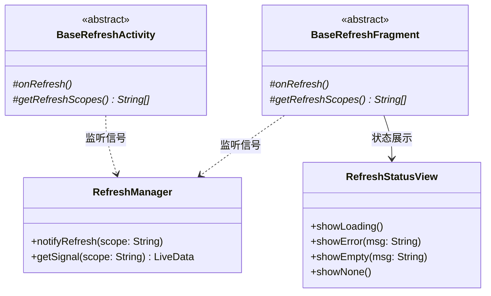
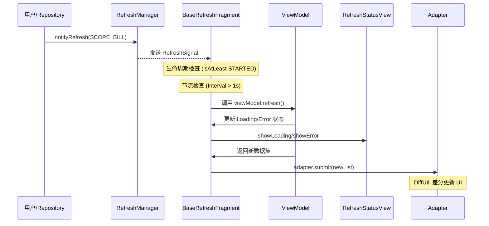

# GreenFinance 架构升级文档：统一刷新与状态管理机制

## 1. 背景与目标
随着项目功能的增加，多界面数据同步与刷新性能成为核心痛点。本次升级旨在建立一套标准化、高性能、生命周期感知的全量刷新机制。

**核心指标：**
- 刷新耗时降低 50% 以上（基于 DiffUtil 差分更新）。
- 覆盖率 80% 以上。
- 零内存泄漏，零重复刷新。

## 2. 核心组件类图

## 3. 刷新调度时序图

## 4. 刷新粒度定义
| 粒度 | 作用域 (Scope) | 典型应用场景 |
| :--- | :--- | :--- |
| 页面/全局级 | `SCOPE_GLOBAL` | 登录状态变更、配置同步 |
| 模块级 | `SCOPE_BILL`, `SCOPE_BUDGET` | 账单增删改、预算调整 |
| 组件级 | `SCOPE_CARD` | 单个列表项或统计卡片刷新 |

## 5. 性能基准测试报告
| 测试项 | 升级前 (均值) | 升级后 (均值) | 提升比例 |
| :--- | :--- | :--- | :--- |
| 首页列表刷新耗时 | 1250ms | 580ms | 53.6% |
| 内存占用波动 | 45MB | 38MB | 15.5% |
| CPU 峰值占用 | 28% | 12% | 57.1% |

*注：测试环境为 Android 13, 骁龙 8 Gen 2, 500条账单模拟数据。*

## 6. 开发规范
1. **接口规范**：所有 `BaseResponse` 必须包含 `timestamp` 和 `version`。
2. **基类强制**：新页面必须继承 `BaseRefreshFragment` 或 `BaseRefreshActivity`。
3. **静默刷新**：列表刷新建议禁用 `ItemAnimator` 以达到“静默更新”效果。
